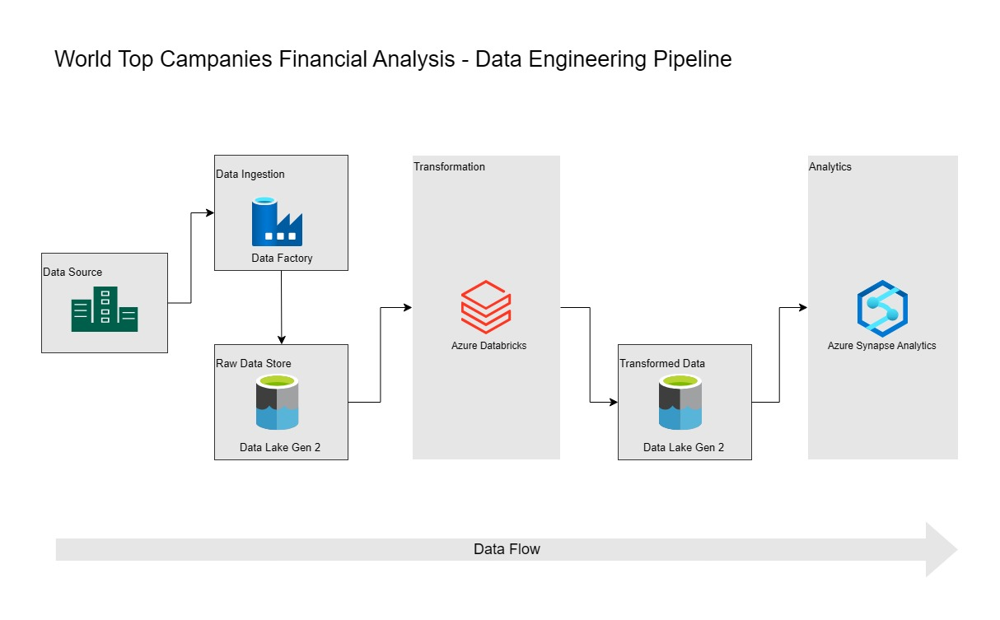

# World Top Companies Financial Analysis - Data Engineering Project

## Project Overview

This project demonstrates a simple Data Engineering pipeline for analyzing financial data of the world's top companies. The pipeline extracts, transforms, and loads (ETL) financial data using various Azure services such as Azure Data Factory, Azure Databricks, Azure Data Lake Gen 2, and Azure Synapse Analytics.

## Architecture 



## Dataset Used
The **dataset** used for this project contains financial analysis data of top companies and is stored in the project’s GitHub repository.

Dataset Link - https://github.com/prathameshj27/dataEngineeringProject-worldTopCompanies-financialAnalysis/tree/main/Data 

### Key Steps in the Pipeline:
1. **Data Extraction**: 
   - The raw data is extracted from the project's GitHub repository using **Azure Data Factory**.
   
2. **Data Storage (Raw)**:
   - This raw data is stored in **Azure Data Lake Gen 2** as the Raw Data Store.

3. **Data Transformation**:
   - The raw data is pulled into **Azure Databricks** where data transformation is performed using **PySpark**.
   
4. **Data Storage (Transformed)**:
   - The transformed data is stored back into **Azure Data Lake Gen 2** as the Transformed Data Store.
   
5. **Data Analytics**:
   - The transformed data is then pulled into **Azure Synapse Analytics** where tables are created, and SQL queries are executed to perform financial analysis.

### Technologies Used:
- **Azure Data Factory**: For orchestrating the data pipeline and ingestion from GitHub.
- **Azure Data Lake Gen 2**: As storage for raw and transformed data.
- **Azure Databricks**: For performing transformations using PySpark.
- **Azure Synapse Analytics**: For data analytics and querying the transformed data.
- **PySpark**: Used in Databricks for data transformation tasks.

---

## Project Architecture

The architecture of this data pipeline can be visualized in the diagram above. The key components are:

1. **Data Source**: 
   - GitHub Repository (containing raw data files).
   
2. **Data Ingestion**: 
   - **Azure Data Factory** pulls raw data from the GitHub repository and stores it in the raw data store.

3. **Raw Data Store**: 
   - **Azure Data Lake Gen 2** stores the raw data files.

4. **Transformation**:
   - **Azure Databricks** pulls raw data from Data Lake, performs transformation using **PySpark**, and stores the results in a transformed data store.
   
5. **Transformed Data Store**:
   - The transformed data is stored back into **Azure Data Lake Gen 2**.

6. **Analytics**:
   - **Azure Synapse Analytics** loads the transformed data from Data Lake Gen 2 to perform further analysis, create tables, and run SQL queries.

---

## Setup and Installation

### Prerequisites
- Azure Subscription with access to the following services:
  - Azure Data Factory
  - Azure Data Lake Storage Gen 2
  - Azure Databricks
  - Azure Synapse Analytics
- GitHub Account with access to the raw dataset.

### Steps to Run the Project:
1. **Clone the Repository**:
   - Clone the repository to your local machine or Azure environment that contains the raw financial data.
   ```bash
   git clone https://github.com/prathameshj27/dataEngineeringProject-worldTopCompanies-financialAnalysis.git
2. **Set Up Azure Data Lake Gen 2**:
   - Create an Azure Data Lake Gen 2 storage account to store both raw and transformed data.
  
3. **Configure Azure Data Factory**:
   - Set up Azure Data Factory to extract data from the GitHub repository and load it into the raw data store in Data Lake Gen 2.

5. **Set Up Azure Databricks**:
   - Create an Azure Databricks workspace.
   - Pull raw data from Data Lake Gen 2 into Databricks.
   - Use PySpark to transform the data.
   - Store the transformed data back into Data Lake Gen 2.

6. **Configure Azure Synapse Analytics**:
   - Create a Synapse workspace.
   - Load the transformed data from Data Lake Gen 2 into Synapse Analytics.
   - Build tables and run SQL queries on the transformed data.

### Usage:
- Data Transformation:
  - PySpark code for transforming the financial data is provided in the Databricks workspace.
  - After transformation, the results are stored in Azure Data Lake Gen 2 as transformed data.
- Data Analytics:
  - Run SQL queries on the transformed data in Azure Synapse Analytics to gain insights into the financial analysis of the world's top companies.
